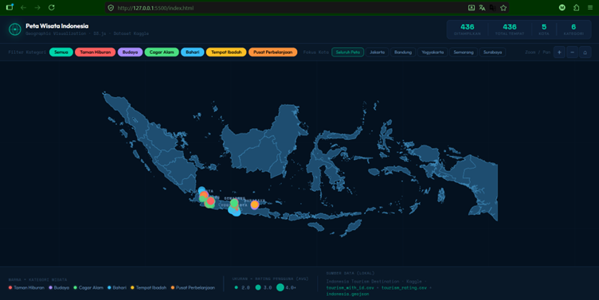
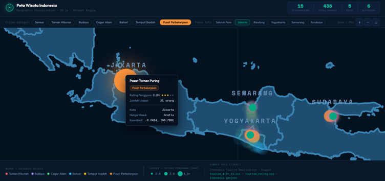
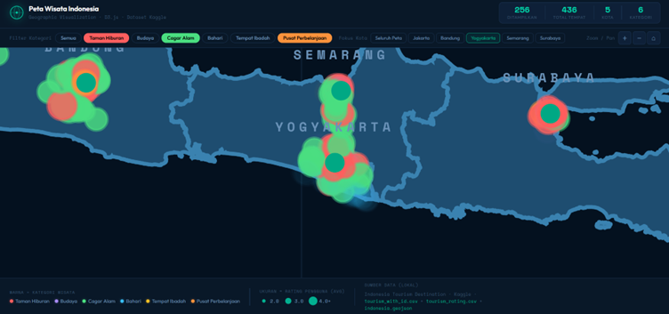

# Indonesia Tourism Destination Map
### An Interactive Geographic Visualization Built with D3.js

---

> To every developer, evaluator, and fellow curious mind who has landed on this page welcome. This is not just a repository. It is a record of a fourth-semester student learning to transform raw data into something people can actually understand and explore. Pull up a chair.

---

## Background

Indonesia is an archipelago of extraordinary scale over 17,000 islands, hundreds of cities, and thousands of tourist destinations scattered across a geography that is notoriously difficult to comprehend from a spreadsheet alone. Latitude and longitude values convey nothing to the human eye. A rating score of 4.3 in isolation tells you very little. But place that score on a map, encode it visually, and suddenly patterns emerge that no table could reveal.

This project was born from a simple question asked during a Data Visualization course: how do we turn rows of numbers into something genuinely useful? The answer became this application an interactive, browser-based map that plots Indonesia's tourism landscape in a way that is intuitive, explorable, and visually meaningful.

---

## What This Project Is

This is a web-based geographic visualization tool built entirely on D3.js (version 7). It renders a vector map of Indonesia from real GeoJSON spatial data, then plots hundreds of tourist destinations directly onto that map based on their precise coordinates. Each destination is represented as a visual data point that communicates two dimensions of information simultaneously: its category through color, and its average user rating through size.

The result is a living, interactive dashboard that lets anyone — from a data analyst to a casual traveler — explore the distribution of Indonesian tourism without opening a single spreadsheet.

---

## Use Cases and Purpose

The primary purpose of this application is to make spatial tourism data accessible and explorable. Specifically, it allows users to:

- Identify geographic clusters of tourism activity across the archipelago at a glance
- Compare user satisfaction levels between destinations visually, without reading raw numbers
- Discover destinations by category — whether Nature, Marine, Cultural, or others filtered to a specific region of interest
- Interact with individual data points to retrieve detailed information on demand

This tool is designed for anyone who benefits from understanding where tourism is concentrated, how it is rated, and what kind of experience each destination offers all within a single, unified visual interface.

---

## Dataset Description

The underlying data is sourced from a public Kaggle dataset titled "Indonesia Tourism Destination." It consists of three primary files:

Datasets Link : https://www.kaggle.com/datasets/aprabowo/indonesia-tourism-destination?utm_source=chatgpt.com

**tourism_with_id.csv** The main dimension table. Contains each destination's profile: place name, tourism category (such as Nature, Marine, or Cultural Heritage), city, and precise geographic coordinates (latitude and longitude).

**tourism_rating.csv** The fact table. Records tens of thousands of individual user review scores on a scale of 1 to 5, linked to each destination by a shared identifier.

**indonesia.geojson** The spatial data file. Contains the MultiPolygon geometry definitions required to render the base map of Indonesia's islands as accurate vector shapes.

---

## Preprocessing: Why It Is Necessary

Raw data from Kaggle is never visualization-ready out of the box. Before any rendering occurs, the dataset is processed through a dedicated Python script (preprocessing.py). This step is not optional it is architecturally essential for three reasons.

**Data Separation.** The location attributes and the user rating scores live in entirely separate files. They share a common identifier, but they must be merged into a single coherent record before the visualization layer can work with them.

**Data Integrity.** The raw dataset contains missing values and severe coordinate outliers some entries point to locations in the middle of the ocean, far outside Indonesian territory. Without cleaning these anomalies, data points would be plotted at geographically incorrect positions, corrupting the map entirely.

**Client-Side Performance.** Fetching and parsing multiple heavy CSV files directly in the browser creates significant performance bottlenecks. By pre-processing and serializing the cleaned, merged data into a single lightweight JSON file, the application can load and render instantly on the client side without any lag.

The preprocessing script handles all of this: merging the dimension and fact tables, dropping null values, filtering coordinate outliers, aggregating individual ratings into a single mean score per destination, and outputting a clean JSON array ready for the visualization engine.

---

## Key Features

**Custom Geographic Projection.** The application uses D3's geoMercator projection combined with geoPath to translate three-dimensional globe coordinates into a scalable, accurate two-dimensional web canvas. The projection is calibrated to center and fit Indonesia precisely within the viewport.

**Dual Visual Encoding.** Every data point on the map communicates two variables at once. Color encodes the tourism category — each category receives a distinct hue for immediate differentiation. Circle radius encodes the average user rating — destinations with higher ratings render as larger circles, creating an intuitive size hierarchy.

**Interactive Tooltip System.** Hovering over any data point triggers a tooltip overlay that displays the destination's name, its category, and its calculated average rating. This allows users to retrieve precise information without cluttering the base map.

**Category Filter.** A filter panel lets users toggle visibility by tourism category. Selecting one or more categories hides all non-matching data points, enabling focused exploration of specific destination types.

**Zoom and Pan Navigation.** Users can zoom into any region of the map and pan freely across the canvas, making it possible to explore dense clusters of destinations — such as those in Java or Bali — without visual overlap obscuring individual data points.

**Soft-Green Aesthetic Theme.** The interface is styled with a custom soft-green color palette designed to reduce eye strain during extended use while maintaining a modern, clean visual identity.

---

## Data Pipeline and Methodology

The project follows a standard Extract, Transform, Load (ETL) architecture.

**Extract.** The raw CSV files are loaded into memory using the Python Pandas library, which provides efficient tabular data handling.

**Transform.** The pipeline performs the following operations in sequence: dropping records with null values in critical columns, filtering out entries whose coordinates fall outside plausible Indonesian geographic bounds, aggregating all individual user ratings per destination to compute a single mean score, and merging the cleaned dimension table with the aggregated rating data using the shared destination identifier as the join key.

**Load.** The resulting DataFrame is serialized into a structured JSON array and written to the local data directory. The JavaScript application then fetches this file asynchronously at runtime and passes it directly to the D3 rendering pipeline.

---

## Tech Stack

| Layer | Technology |
|---|---|
| Visualization Engine | D3.js v7 |
| Application Logic | Vanilla JavaScript (ES6) |
| Layout and Styling | HTML5 and CSS3 |
| Data Wrangling | Python 3 with Pandas and NumPy |

---

## Repository Structure

```
indonesia-tourism-map/
├── css/
│   └── styles.css
├── data/
│   ├── indonesia.geojson
│   ├── package_tourism.csv
│   ├── tourism_rating.csv
│   ├── tourism_with_id.csv
│   └── user.csv
├── js/
│   ├── d3.v7.min.js
│   └── main.js
├── index.html
├── preprocessing.py
└── README.md
```

---

## Initialization and Running the Project

Modern browsers enforce strict Cross-Origin Resource Sharing (CORS) policies that block JavaScript from fetching local files directly via the `file://` protocol. Because this application dynamically loads the GeoJSON map and the processed JSON dataset at runtime, the project must be served over HTTP — even when running locally. The steps below walk through the entire setup from cloning to a running browser session.

**Step 1 — Clone the repository.**

Open your terminal and run the following command, substituting your actual username and repository name:

```bash
git clone https://github.com/Nixzouxu/Geographic-Visualization-With-D3.js.git
```

**Step 2 — Navigate into the project directory.**

```bash
cd Geographic-Visualization-With-D3.js
```

**Step 3 — Run the preprocessing script.**

Before opening the visualization, generate the cleaned JSON data file by running:

```bash
python preprocessing.py
```

This will produce the processed JSON file in the data directory that the map depends on.

**Step 4 — Start a local HTTP server.**

If Python is installed on your system (Python 3 is recommended), run:

```bash
python -m http.server 8000
```

Alternatively, if you are using Visual Studio Code, install the Live Server extension, right-click on index.html in the file explorer, and select "Open with Live Server." This achieves the same result without the terminal.

**Step 5 — Open the application.**

Navigate to the following address in your browser:

```
http://localhost:8000/
```

The map will load and render automatically.

---

## Visualization Results

**Figure 1 — Full Map Overview**



The complete visualization showing the geographic distribution of tourist destinations across the Indonesian archipelago. Each data point is color-coded by tourism category and sized proportionally to its average user rating, giving an immediate sense of where tourism is concentrated and which destinations are most highly regarded.

**Figure 2 — Tooltip and Hover Interaction**



When the cursor is directed toward a specific data point, a tooltip overlay appears displaying the destination's name, its tourism category, and its calculated average rating. This interaction layer allows for precise data retrieval without disrupting the overall visual layout.

**Figure 3 — Category Filter and Zoom Functionality**



A demonstration of the zoom and filter features working in combination. The map is zoomed into a specific region while one or more category filters are active, isolating only the relevant data points within that area. This use case reflects the application's core value proposition: focused, spatial exploration without the noise of unrelated data.

---

## Long-Term Vision

This project currently operates as a fully client-side, static application. The long-term roadmap extends significantly beyond its current scope.

The most immediate planned evolution is the integration of a live backend database to replace the static JSON file. This would allow the dataset to be updated dynamically without requiring a new preprocessing run, and would open the door to user-submitted reviews being incorporated in real time.

Further ahead, the vision includes a machine learning-based recommendation engine embedded directly into the interface. A user would be able to input their travel preferences category interests, budget range, geographic region and receive a ranked list of personalized destination recommendations plotted directly onto the map as a custom itinerary layer.

These are long-term goals. But they are the kind of goals that give a project direction.

---

## How to Contribute

This project is actively maintained and genuinely open to collaboration. If you have spotted a bug in the projection algorithm, have an idea for optimizing the D3 rendering pipeline, or want to propose a new feature contributions are welcome.

To contribute, fork this repository, create a new feature branch with a descriptive name, make your changes with clear and well-commented code, and submit a pull request with a short explanation of what was changed and why.

For substantial changes or new feature proposals, opening an issue first to discuss the approach before writing code is strongly recommended. This keeps the review process efficient and ensures alignment before significant effort is invested.

Constructive feedback, code reviews, and improvement suggestions are just as valuable as code contributions.

---

## Closing

Thank you for reading this far. Most people skim a README the fact that you are here, at the bottom, suggests you were genuinely interested in what this project is trying to do.

Turning raw coordinates and rating scores into a navigable visual map of an entire nation's tourism landscape was not a trivial exercise. It required understanding data pipelines, geographic projections, browser rendering constraints, and user interaction design all simultaneously. It was the most technically demanding and most rewarding project of this semester.

If this project sparks an idea, surfaces a question, or simply shows you something interesting about the geography of Indonesian tourism, then it has done exactly what it was built to do.

---

*Developed with curiosity and excessive amounts of coffee.*

*Muhammad Hafidz — Informatics Students, Semester 4*

